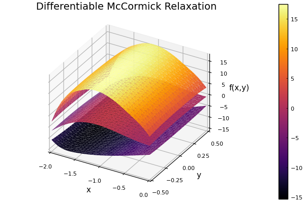

# McCormick.jl

A Forward McCormick Operator Library

| **PSOR Lab** | **Build Status**                                                        | **Persistent DOI**                       |                                              
|:------------:|:-----------------------------------------------------------------------:|:----------------------------------------:|
| [](https://psor.uconn.edu/) | [](https://github.com/PSORLab/McCormick.jl/actions?query=workflow%3ACI) [](https://codecov.io/gh/PSORLab/McCormick.jl) | [](https://zenodo.org/badge/latestdoi/245830962) |

McCormick.jl is a component package in the EAGO ecosystem and is reexported by [EAGO.jl](https://github.com/PSORLab/EAGO.jl). It contains a library of forward McCormick operators (both nonsmooth and differentiable). Documentation for this is included in the [EAGO.jl](https://github.com/PSORLab/EAGO.jl) package and additional usage examples are included in [EAGO-notebooks](https://github.com/PSORLab/EAGO-notebooks) as Jupyter Notebooks.

## McCormick Operator Variants

Each McCormick object is associated with a
parameter `T <: RelaxTag` which is either `NS` for nonsmooth relaxations ([Mitsos2009](https://epubs.siam.org/doi/abs/10.1137/080717341), [Scott2011](https://link.springer.com/article/10.1007/s10898-011-9664-7)), `MV` for multivariate relaxations ([Tsoukalas2014](https://link.springer.com/article/10.1007/s10898-014-0176-0), [Najman2017](https://link.springer.com/article/10.1007/s10898-016-0470-0)),
or `Diff` for differentiable relaxations ([Khan2016](https://link.springer.com/article/10.1007/s10898-016-0440-6), [Khan2018](https://link.springer.com/article/10.1007/s10898-017-0601-2), [Khan2019](https://www.tandfonline.com/doi/abs/10.1080/02331934.2018.1534108)). Conversion between `NS`, `MV`, and `Diff` relax tags are not currently supported. Convex and concave envelopes are used to compute relaxations of univariate functions.

## Supported Operators

In addition to supporting the implicit relaxation routines of [Stuber 2015](https://www.tandfonline.com/doi/abs/10.1080/10556788.2014.924514?journalCode=goms20), this package
supports the computation of convex/concave relaxations (and associated subgradients) for
expressions containing the following operations:

**Common Algebraic Expressions**: `inv`, `log`, `log2`, `log10`, `exp`, `exp2`, `exp10`,
`sqrt`, `+`, `-`, `^`, `min`, `max`, `/`, `*`, `abs`, `step`, `sign`, `deg2rad`, `rad2deg`, `abs2`, `cbrt`, `fma`, `xlogx`, `arh`, `xexpax`

**Trigonometric Functions**: `sin`, `cos`, `tan`, `asin`, `acos`, `atan`, `sec`, `csc`, `cot`, `asec`, `acsc`, `acot`, `sind`, `cosd`, `tand`, `asind`, `acosd`, `atand`, `secd`, `cscd`, `cotd`, `asecd`, `acscd`, `acotd`, `sinpi`, `cospi`

**Hyperbolic Functions**: `sinh`, `cosh`, `tanh`, `asinh`, `acosh`, `atanh`, `sech`, `csch`, `coth`, `acsch`, `acoth`

**Special Functions**: `erf`, `erfc`, `erfcinv`, `erfc`

**Activation Functions**: `relu`, `leaky_relu`, `param_relu`, `sigmoid`, `bisigmoid`,
                          `softsign`, `softplus`, `maxtanh`, `pentanh`, `gelu`,
                          `elu`, `selu`, `swish1`

**Bound Specification Functions**: `positive`, `negative`, `lower_bnd`, `upper_bnd`, `bnd`

**Other Functions**: `one`, `zero`, `intersect`, `real`, `dist`, `eps`, `<`, `<=`, `==`

Differentiable relaxations (`Diff <: RelaxTag`) are supported for the functions given in [Khan2016](https://link.springer.com/article/10.1007/s10898-016-0440-6), [Khan2018](https://link.springer.com/article/10.1007/s10898-017-0601-2), [Khan2019](https://www.tandfonline.com/doi/abs/10.1080/02331934.2018.1534108). However, differentiable relaxations for other nonsmooth terms listed above have yet to be developed and as such have been omitted.

## Bounding a Univariate Function

In order to bound a function using a McCormick relaxation, you first construct a McCormick object (`x::MC`) that bounds the input variables, and then you pass these variables to the desired function.

In the example below, convex/concave relaxations of the function

$$f(x) = x (x - 5) \sin(x)$$

are calculated at $x = 2$ on the interval $X = [1, 4]$.

```julia
using McCormick

# Create MC object for x = 2.0 on [1.0, 4.0] for relaxing
# a function f(x) on the interval Intv

f(x) = x*(x - 5.0)*sin(x)

x = 2.0                          # Value of independent variable x
Intv = Interval(1.0, 4.0)        # Define interval to relax over
                                 # Note that McCormick.jl reexports IntervalArithmetic.jl
                                 # and StaticArrays. So no using statement for these is
                                 # necessary.
# Create McCormick object
xMC = MC{1,NS}(x, Intv, 1)

fMC = f(xMC)             # Relax the function

cv = fMC.cv              # Convex relaxation
cc = fMC.cc              # Concave relaxation
cvgrad = fMC.cv_grad     # Subgradient/gradient of convex relaxation
ccgrad = fMC.cc_grad     # Subgradient/gradient of concave relaxation
Iv = fMC.Intv            # Retrieve interval bounds of f(x) on Intv
```

Plotting the results, we can easily visualize the convex and concave relaxations, interval bounds, and affine bounds constructed using the subgradient at the middle of $X$.


## Bounding a Multivariate Function

This can readily be extended to multivariate functions, for example: 

$$
\begin{aligned}
& f(x, y) = \big(4 - 2.1 x^{2} + \frac{x^{4}}{6} \big) x^{2}\\
& \qquad \qquad + \\; x y + (-4 + 4 y^{2}) y^{2}\\
& X = [-2, 0]\\
& Y = [-0.5, 0.5]
\end{aligned}
$$

```julia
using McCormick

# Define function
f(x, y) = (4.0 - 2.1*x^2 + (x^4)/6.0)*x^2 + x*y + (-4.0 + 4.0*y^2)*y^2

# Define intervals for independent variables
n = 30
X = Interval{Float64}(-2, 0)
Y = Interval{Float64}(-0.5, 0.5)
xrange = range(X.lo, stop=X.hi, length=n)
yrange = range(Y.lo, stop=Y.hi, length=n)

# Calculate differentiable McCormick relaxation
for (i,x) in enumerate(xrange)
    for (j,y) in enumerate(yrange)
        z = f(x, y)                 # Calculate function values
        xMC = MC{1,Diff}(x, X, 1)   # Differentiable relaxation for x
        yMC = MC{1,Diff}(y, Y, 2)   # Differentiable relaxation for y
        fMC = f(xMC, yMC)           # Relax the function
        cv = fMC.cv                 # Convex relaxation
        cc = fMC.cc                 # Concave relaxation
    end
end
```



## Citing McCormick.jl

McCormick.jl is a component of the [EAGO.jl](https://github.com/PSORLab/EAGO.jl) ecosystem. Please cite the following paper when using McCormick.jl:

```
M. E. Wilhelm & M. D. Stuber (2022) EAGO.jl: easy advanced global optimization in Julia,
Optimization Methods and Software, 37:2, 425-450, DOI: 10.1080/10556788.2020.1786566
```


## Unit Testing Note

While McCormick.jl generally supports Julia 1.1+, some functions may return an error for Julia versions less than 1.3. In particular, `cbrt` will result in a StackOverflow when called. McCormick is unit tested using Julia versions 1.3 and beyond.

### References

- **Khan KA, Watson HAJ, Barton PI (2017).** Differentiable McCormick relaxations. *Journal of Global Optimization*, 67(4):687-729.
- **Khan KA, Wilhelm ME, Stuber MD, Cao H, Watson HAJ, Barton PI (2018).** Corrections to: Differentiable McCormick relaxations. *Journal of Global Optimization*, 70(3):705-706.
- **Khan KA (2019).** Whitney differentiability of optimal-value functions for bound-constrained convex programming problems. *Optimization* 68(2-3): 691-711
- **Mitsos A, Chachuat B, and Barton PI. (2009).** McCormick-based relaxations of algorithms. *SIAM Journal on Optimization*, 20(2):573–601.
- **Najman J, Bongratz D, Tsoukalas A, and Mitsos A (2017).** Erratum to: Multivariate McCormick relaxations. *Journal of Global Optimization*, 68:219-225.
- **Najman, J, Bongartz, D., and Mitsos A (2019).** "Relaxations of thermodynamic property and costing models in process engineering." *Computers & Chemical Engineering*, 130, 106571.
- **Scott JK,  Stuber MD, and Barton PI. (2011).** Generalized McCormick relaxations. *Journal of Global Optimization*, 51(4):569–606.
- **Stuber MD, Scott JK, Barton PI (2015).** Convex and concave relaxations of implicit functions. *Optim. Methods Softw.* 30(3), 424–460
- **Tsoukalas A and Mitsos A (2014).** Multivariate McCormick Relaxations. *Journal of Global Optimization*, 59:633–662.
- **Wechsung A, Scott JK, Watson HAJ, and Barton PI. (2015).** Reverse propagation of McCormick relaxations. *Journal of Global Optimization* 63(1):1-36.
